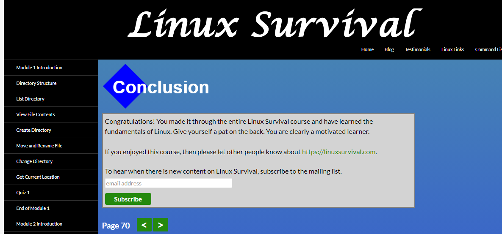
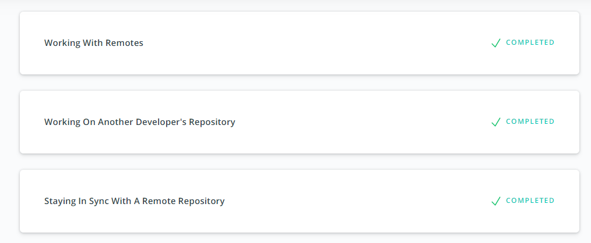
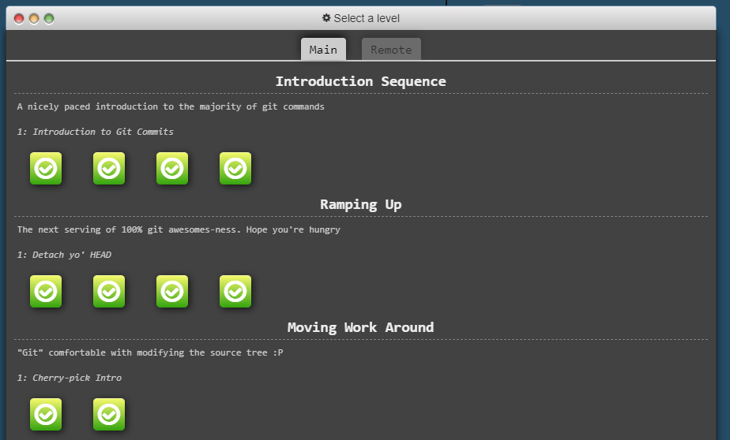
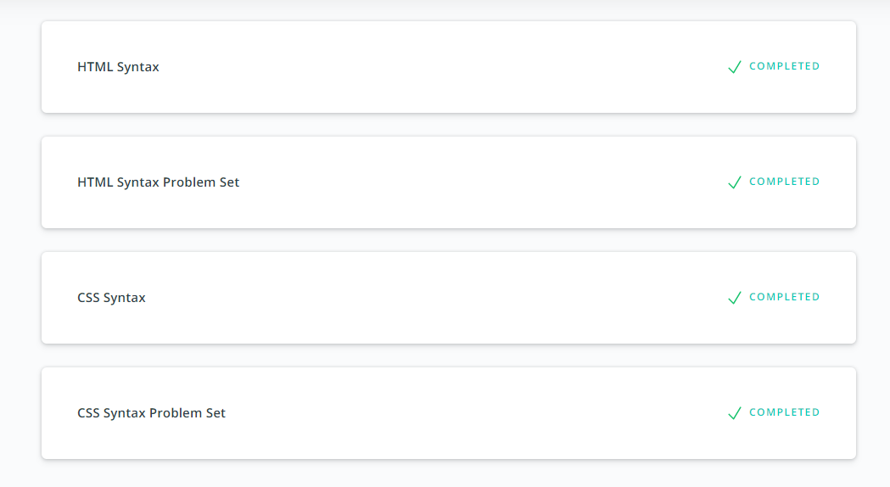
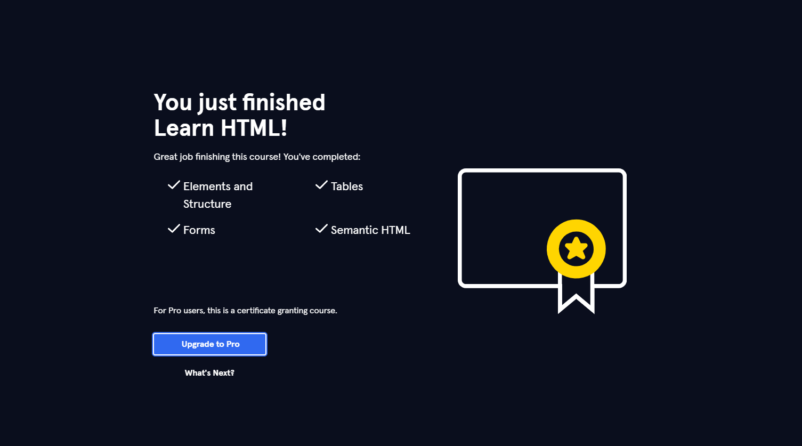
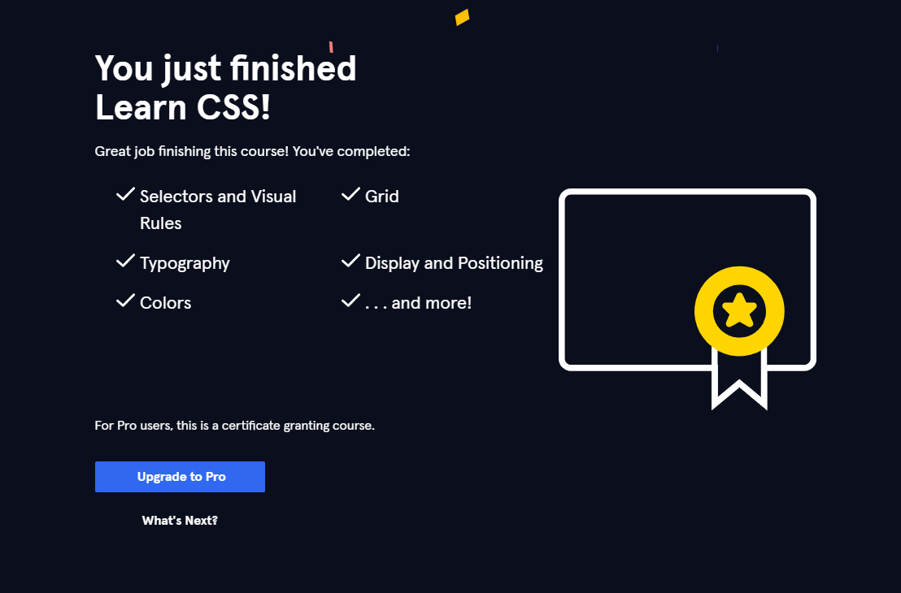
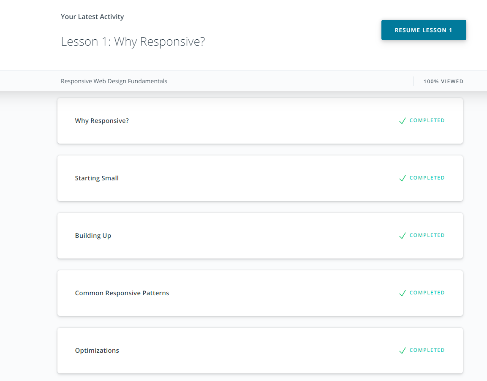
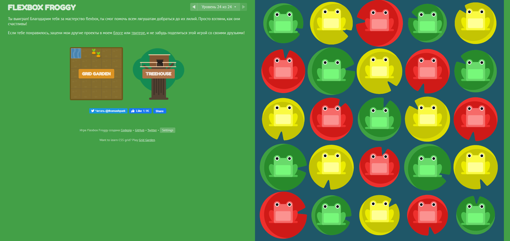
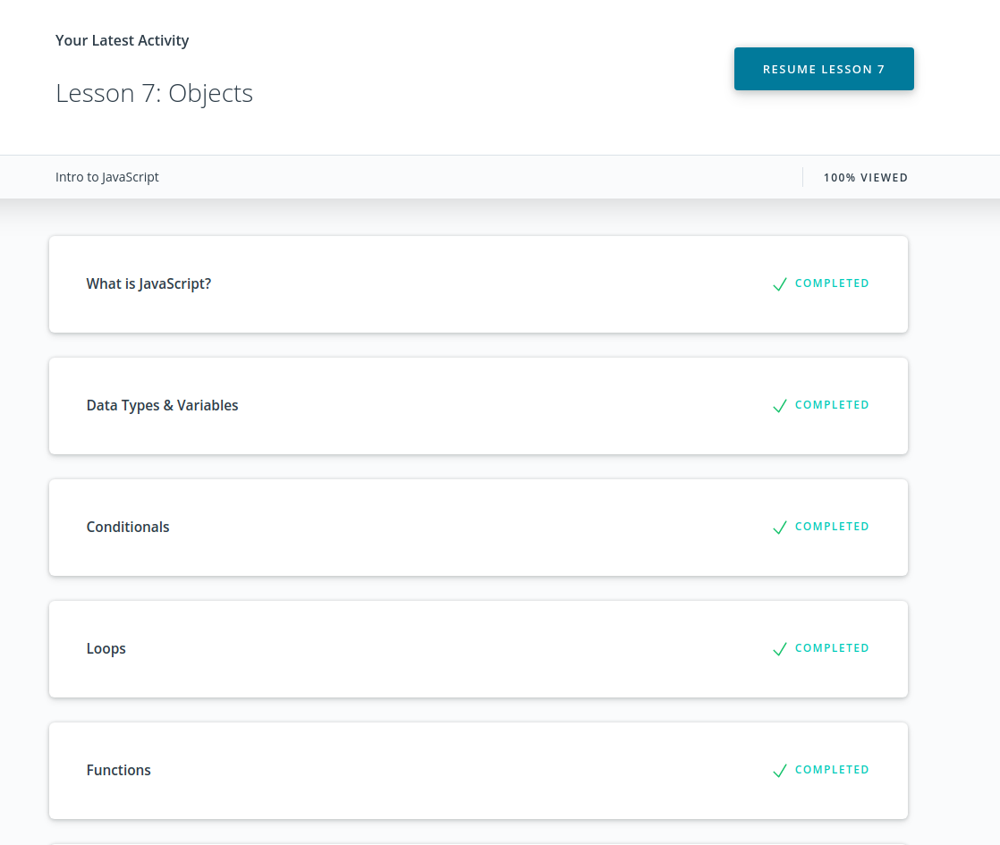
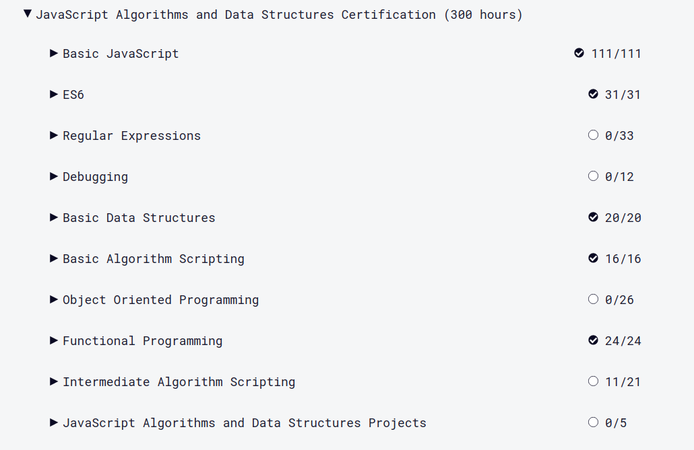

# Front-End Course. Contents
---

## Stage 0. Self-Study
---
> Also keeping cheetsheets [here](https://github.com/yaripey/some-knowledge).

### Study plan

#### General

- [x] 0. Git Basics
- [x] 1. Linux CLI and Networking
- [x] 2. VCS (hello gitty), GitHub and Collaboration

#### Front-End Basics

- [x] 3. Intro to HTML & CSS
- [x] 4. Responsive Web Design
- [ ] 5. HTML & CSS Practive
- [ ] 6. JavaScript Basics
- [ ] 7. Document Object Model

#### Advanced Topics
- [ ] 8. Building a Tiny JS World (pre-OOP)
- [ ] 9. Object oriented JS
- [ ] 10. OOP exercise
- [ ] 11. Offline Web Applications
- [ ] 12. Memory pair game
- [ ] 13. Website Performance Optimization
- [ ] 14. Friends App

## Linux CLI, and HTTP

This was an interesting course. I've had some experience with linux before, learning by myself a little and also had some lessons at the university. For me personaly, the permissions theme was dark and scary, but this course made it very simple and clear for me. These are important commands that will be definitely used by me in the future.

## Git Collaboration

Udacity course was really interesting. It answered some of the questions I asked myself after previous lessons and now I'm sure in the knowledge I got earlier.

Learngitbranching, in my opinion, is teaching git branching in the best way possible, allowing playing around and testing stuff even if it's not stated in the task. I'll definitely use it's playground to improve my skills of moving stuff around in the future.

## Intro to HTML and CSS

These courses were very interesting for me. I learned html/css by myself through different courses and lessons on the web, but courses that are present in this Stage0 are very structured and it helped me sort out a lot of questions I was left with after completing lessons by myself before. Grids in CSS was a completely new topic and I'm definitely interested in using it in the future.

## Responsive Web Design

I think that responsive design is one of the most crucial parts of front-end development right now and I'm happy that these lessons were included in the course. They were extremely informative and easy to pick up. And I loved the frog-minigame, frogs are the best :frog:.

## HTML & CSS Practice
This was an interesting task for me. I tried to make the design as close as possible to the template in the task and did my best in implementing what I learned on this course before.

## JS-Basics

This was a tough one. I learned a whole lot about the JS in general. Learning on my own mistakes is one of the best methods and there was a lot of learning. Definitely implementing a lot of interesting methods from algorythms section into my own workflow.